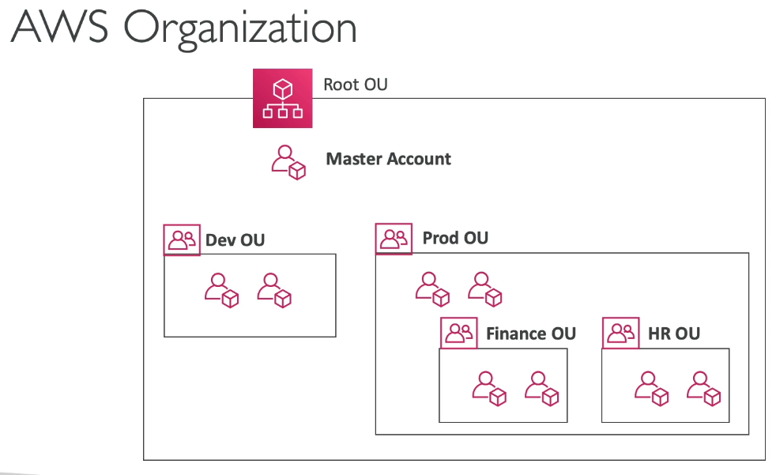
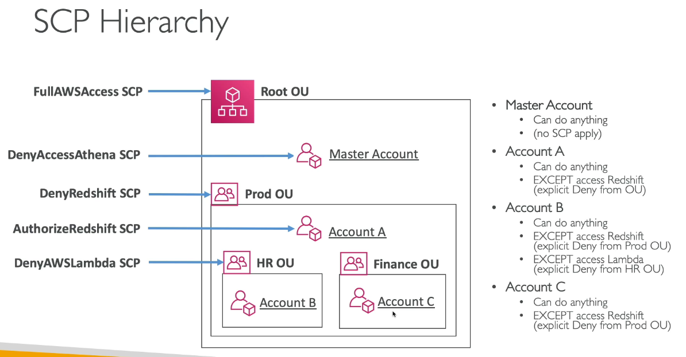
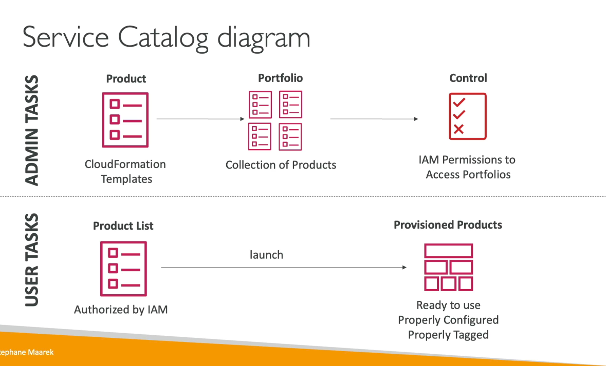

# AWS Account Management, Billing & Support
## AWS Organizations
- Global Service
- Allows to manage multiple AWS accounts
- the main account is the master account
- You can apply Service Control Policies (SCP) to restrict account privileges
- API is available to automate AWS account creation

Cost Benefits:
- Consolidated billing across all accounts
- pricing benefits from aggregated usage (volume discounts for EC2, S3,...)
- Pooling of reserved EC2 instances for optimal savings

## Multi Account Strategies
- Create accounts per departmemts, dev ,stg, prod or etc.

## Organizational Units
You can organize accounts by business units, environments, project based.

## Service Control Policies (SCP)
- Whitelist or blacklist IAM actions
- Applied at the OU or Account level
- Does not apply to the master account
- SCP is aplied to all the USers and ROles of the Account, including Root.
- The SCP does not affect service-linked roles
- SCP must have an explicit Allow (does not allow anything by default)

Use cases:
- Restrict access to certain services
## SCP Hierarchy
The OU will take priority over denys or allowed applied to the account within that OU.

## Organizations Consolidated Billing
- One Bill
- Combined Usage: combine the usage across all AWS accounts in the AWS Org to share the volume pricing, reserved instances and savings plans discounts.
- Management account can turn off Reserved Instances discount sharing for any account in the AWS organization, including itself.
## AWS Control Tower
- Easy wat ro set up and govern a secure and compliant multi-account AWS environment based on best practices

Benefits:
- Automate the setup of your environment in a few clicks
- Automate ongoing policy management using guardrails
- detect policy violations and remediate them
- Monitor compliance through an interactive dashboard

AWS ControlTower runs on top of AWS organizations, it will automatically set up AWS organizations to organize accounts and implement SCPs (service control policies)

- Landing zone is what is set up after initial configuration
- You will choose your shared accounts here
- You can manage SSO and how users will access AWS
- It offers a full management suite of things for the orgs
## AWS Resource Access Manager (AWS RAM)
- Share AWS resources that you own with other AWS accounts
- Share with any account or within your organization
- Avoid Resource Duplications
- Supported resources include aurora, VPC subnets, transit Gateway, Route53, EC2 dedicated hosts
- Is useful for sharing things like a VPC
## AWS Service Catalog
- Users that are new to AWS have too many options and may create stacks that are not compliant/in line with the rest of the org
- Some users just want a quick self-service portal to launch a set of authorized products pre-defined by admins

## Pricing Models in AWS
1. Pay as you go: pay for what you use, remain agile, responsive, meet scale demands
2. Save when you reserve: reserve resources and minimize risks, predictably manage budgets, comply with long-term requirements
3. Pay less by using more: Volume based discounts
4. Pay less as AWS grows

### Free Services & Free tier 
- IAM, VPC, Consolidated Billing and services like Elastic Beanstalk, Cloudformation and Autoscaling Groups are free.  You will need to pay for the resources that you do created with ASG, Cloudformation beanstalk and etc!
### Compute Pricing - EC2
- only charged for what you use
- Number of instances
- Instance Configuration (Size, Memory, Region, OS and Software)
- ELB running time and amount of data processed

On-demand instances: 
- Minimum of 60 seconds
- Pay per second (Linux/Windows) or per hours (other)

Reserved Instances:
- Up to 75% discound comparede to On-Demand on hourly rate
- 1-3 years commitment

Spot instances
- Up to 90% discount compated to On-demand on hourly rate
- Bid for unused capacity

Dedicated Hosts:
- On-demand
- reservation for 1-3 years

Savings Plan:
- an alternative to save on sustained usage

### Lambda & ECS pricing
Lambda: 
- Pay per call
- Pay per duration 

ECS:
- EC2 launch type model: No additional fees, you pay for AWS resources stored and created in your app

Fargate:
- Fargate Launch Type Model: Pay for vCPU and memory resources allocated to your applications in your containers

### AWS S3 pricing
will pay for number and size of objects, pay for requests, pay for data transfer out of S3 region, s3 transfer acceleration, lifecycle transitions
### EBS pricing
- Volume type (based on performance)
- Storage voulme in GB per month provisioned

IOPS: 
- General purpose SSD: included
- Provisioned IOPS SSD: Provisioned amount in  IOPS
- Magnetic: Number of requests

Snapshots:
- Added data cost per GB per month

Data Transfer:
- Outbound data transfer are tiered for volume discounts
- inbound is free
### Database Pricing - RDS
- per hour billing, compute engine, size, memory class
- additional storage per GB per month
- input and output requests per month
- Deployment type (Single AZ, Multiple AZ)
- Data Transfer: outbound data transfer is tiered for volume discounts, inbound is free
### CloudFront Pricing
- Pricing is different based on edge region
- Bill will be aggregated and applied to one bill
- Data transfer in and out
- Also wil pay for the requests inbound
 ### Networking Pricing
- Traffic between AWS private IPs and for traffic coming inbound
- different AZ but using private IP to chat it is 1 cent per GB.
- Private IP is better for savings and network performance
- use same AZ for maximum savings.

### Savings Plan
- Allows you to commit a certain $ amount per hour for 1 or 3 years
- easiest way to setup a long-term commitments on AWs
- EC2 savings plan will allow you to commit to usage of individual instance familes in a region
- up to 72% discount compared to On-Demand
- Compute Saving Plan; up to 66% discount compared to On-Demand regardless of Family, Region, size and OS, tenancy
- Compute Options: EC2, Fargate and Lambda
- Machine Learning Savings plan: SageMaker
- Can set up a savings plan in AWS Cost Explorer console
### AWS Compute Optimizer
- reduce costs and improve performance by recommending optimal AWS resource workloads
- helps you choose optimal configurations for your workload to lower costs.  Uses machine learning to analyze resource configurations
## Billing & Consting Tools
 - Estimating costs in the cloud: AWS Price Calculator
 - Tracking costs in the cloud: Billing Dashboard, Cost Allocation tags, cost and usage reports, cost explorer
 - Monitoring against costs plans: Billing Alarms. Budgets
 ## AWS Pricing Calculator 
 - Estimate the cost for your solution architecture https://calculator.aws/#/addService
 ## Tracking Costs in the Cloud
- AWS Billing Dashboard is a high level view to see what is happening with your costs, forecasted usage and costs and etc.
- AWS Free Tier Dashboard which will show you how you are doing for the month
- Cost Allocation Tags allow us to track out costs on a detailed level and group them.  There are AWS defined tags and User defined tags
-  Tagging can be used to create resource groups which can be used to organize the resources
## Cost and Usage Report
- Provides a comprehensive set of AWS cost and usage data.  It can be integrated with Athena, Redshift or Quicksight.  Will be very detailed!
## Cost Explorer
- Visual tool that provides a high level overview for total costs across all accounts, you can access optimal saving plan and you can forecast usage up to 12 months ahead.
- Forecast usage can let you look at previous costs and you can see a visualization of future costs.
## Billing Alarms in Cloudwatch
- Billing data metric is stored in CloudWatch us-east-1
- Billing data in us-east-1 is aggregated across all regions and will represent total costs.  It is actual costs not projected costs
- Allows you to set an alarm when going past a certain budget
## AWS Budgets
- Create a budget and send alarms when costs exceed the budget

Four Types of Budgets:
- Usage, Cost, Reservation, Savings Plans

For Reserved Instances(RI)
- track utilization 
- supports EC2, Elasticache, RDS, Redshift

Up to 5 SNS notifications per budget.   The first two budgets are free and then after that you will pay 2 cents per day for budgets.

## AWS Cost Anomaly Detection
- Continually monitors cost and usage using ML to detect unusual spends
- Monitor AWS services, member accounts, cost allocations tags or cost categories.
- Get notified with individual alerts or daily/weekly summary
## AWS Service Quotas
- Notify you when you're close to a service quota value threshold
- Can create CloudWatch alarms on the Service Quotas console
- can increase AWS service quotas or shutdown resources before limit is hit.
## Trusted Advisor
- No need to install anything - high level AWS account assessment
- it will run checks and tell you whether the checks are passing or not

Will analyze your AWS accounts and provides recommendations on 5 categories:
- Cost Optimizations
- Performance
- Security
- Fault tolerance
- Service limits
## Trusted Advisor - Support Plans
What are some of the core checks for Trusted Advisor?

There are 7 Core Check for the Basic & Developer Support plan:
- S3 bucket permissions
- Security Groups - Specific Ports are not unrestricted
- IAM Use (one IAM user minimum)
- MFA on Root Account
- No EBS Public Snapshots
- No RDS Public Snapshots
- Service Limits

Full checks (Business and Enterprise Support Plan):
- Full checks available on the 5 categories?
- Ability to set cloudwatch alarms when reaching limits
- Programmatic Access using AWS support API
## AWS Support Plans Pricing
### Basic Support: Free
- AWS trusted advisor we get access to 7 core trusted advisor checks
- AWS Personal Health Dashboard - A personalized view of the health of AWS services, and alerts when your resource are impacted 
### Developer Plan
- All Basic support plan + Business hours email access to Cloud Support Associates
- Unlimited cases/ 1 primary contact
- Case severity / response times: general guidance: < 24 business hours, System Impaired < 12 business hours
### AWS Business Support Plan (24/7)
- Intended to be used if you have production workloads
- Trusted Advisor - will have full set of checks along with API access
- 24x7 phone, email and chat access to Cloud Support Engineers
- Unlimited cases / unlimited contacts
- Access to Infrastructure Event Management for additional fee
- Case severity / response times: General guidance: < 24 business hours, System impaired: < 12 business hours, Production system impaired: < 4 hours, Production system down: < 1 hours
### AWS Enterprise On-Ramp Support Plan (24/7)
- Access to a pool of Technical Account Managers
- Concierge Support Team (for billing and account best practices)
- Infrastructure Event Management, Well-Architected & Operations Reviews
- Case Severity / response times: Production System impaired < 4 hours, Production System Down: < 1 hour, Business Critical System Down: < 30 minutes.

### AWS Enterprise Support Plan
- Designated Technical Account Manager
- Will have everything the enterprise team does and more
- Business critical system down response time drops to less than 15 minutes
## Account Best Practices
- If you want to operate using multiple accounts it is recommended to use AWS Organizations
- Use SCP to restrict account power
- Easy to set up multiple accounts with best practices with AWS Control Tower
- USe tags and cost allocations tags for easy management & billing
- IAM guidelines: MFA, least privilege, password policy, password and access key rotation
- AWS Config: to record all resources configurations & compliance over time
- CloudFormation: to deploy stacks across accounts and regions
- Trusted Advisor: to get insights, Support Plan adapted to your needs
- Send service logs and access logs to S3 or CloudWatch Logs
- Use cloud trail to record API calls made within your account
- if your AWS account is compromised: change the root password, delete and rotate all passwords/keys, contact the AWS support.
- Use AWS Service Catalog to allow users to create predefined stacks defined by admins
## Billing Summary
- Compute Optimizer: recommendations on resource configurations to reduce cost
- Pricing Calculator: costs of services on AWS
- Billing Dashboard: high level overview + free tier dashboard
- Cost Allocation Tags: tag resources to create detailed reports
- Cost and Usage reports: most comprehensive billing dataset
- Cost Explorer: View current usage(detailed) and forecast usage
- Billing Alarms: in us-east-1 track overall and per service billing
- Budgets: More advanced - track usage, costs, RI, and get alerts
- Saving Plans: easy way to save based on long term AWS usage
- Cost Anomaly detection : detect unusual spends using Machine Learning
- Service quotas: Notify you when you're close to service quota threshold
