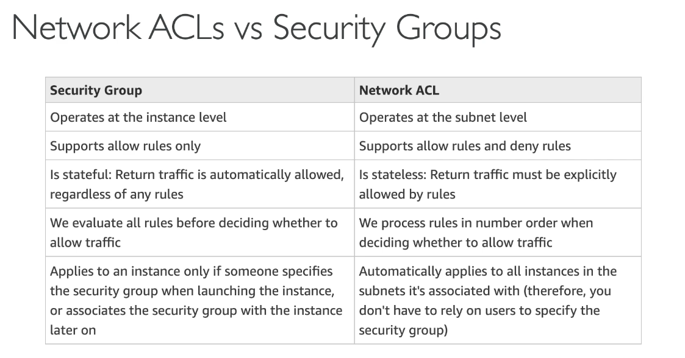

# AWS Networking
## VPC
VPC stands for virtual private cloud
## IP Addresses in AWS
- IPV4
    - Public IPV4 can be used on the internet, EC2 instances gets a new public IP every time you stop and then start it
    - Private IPV4 can be used on private networks (LAN) such as internal AWS networking.  These Private IPV4 addresses are constant

Elastic IP: Allows you to attach a fixed public IPV4 address to an EC2 instance

- IPV6 is Internet Protocol version 6 
    - Every IP address is public (no private range)

## VPC and Subnets
- VPC is a private network to deploy your AWS resources.
- Subnets allow you to partition your network inside your VPC
- A public subnet is a subnet that is accessible from the internet
- A Private subnet is not accessible from the internet
- Route Tables allow us to define access to the internet and between subnets.

VPC CIDR Range = List of IP addresses allowed within a VPC
## Internet Gateway & NAT Gateways
- Internet Gateways help our VPC instances connect with the internet
- Public Subnets have a route to the internet gateway
- NAT Gateway will allow instances in private subnet to access the internet while remaining private.

- There are several subnets available within the default VPC, all a subnet is doing is segment our network inside the VPC.
- See some details of the CIDR with CIDR.xyz
- Internet Gateway will be attached to a VPC, a VPC can only have 1 Internet Gateway
-  Subnets will have their own route tables that define what local and public access the subnet will have
- NAT Gateway will be associated with a subnet and will allow the instances in a private subnet to access the internet.
## Network ACL & Security Groups
Scenario: There is an EC2 instance inside a public subnet with the VPC.  We can set a NACL (Network ACL) which is a firewall that controls traffic from and to subnet. We can attach DENY or ALLOW rules.  
- NACLs are attached at the subnet level, rules (deny/allow) only include IP addresses.
### Security Groups
- Security Groups are a firewall that controls traffic to and from an EC2 instance.
- can have only ALLOW rules
- Rules include IP addresses and other security groups
- Security Group is applied at EC2 level

### VPC Flow Logs
VPC Flow logs  capture information about all IP traffic going into your interfaces
- VPC Flow Logs
- Subnet Flow Logs
- Elastic Network Interface Flow Logs
- This can help monitor and troubleshoot connectivity issues
- Captures network information from AWS managed interfaces too
## VPC Peering
- Connect two VPCs privately using AWS' network, must not have overlapping CIDR range.
- VPC Peering connection is not transitive(must be established for each VPC that need to communicate with one another)
Navigate to your VPC, go to flow logs section and then you can customize how the flow logs will operate.
## VPC Endpoints
- Endpoints allow you to connect to AWS services using a private network instead of the public www network
- This provides enhanced security and lower latency to access AWS services
- VPC Endpoint Gateway: S3 & DynamoDB
- VPC Endpoint interface: The rest of the AWS services
## PrivateLink
Allows you to connect service running within your VPC to other VPCs.  How is this done? 
- Consumer App will need to create a Elastic Network Interface which would connect to the Network Load Balancer of the 3rd party app (3rd party VPC).  All the internet traffic would go through the private link.
## DirectConnect & Site-to-Site VPN

- Site to Site VPN: Connect an on-premises VPN to AWS.
- On Premises must us a Customer Gateway (CGW)
- AWS: Must use a virtual Private Gateway (VGW)
### Direct Connect
- Direct Connect: Establish a physical connection between on-premises and AWS.
- Goes over a private network
- The connection is private, secure and fast
- Take at least a month to establish
## ClientVPN
- Connect from your computer using OpenVPN to your private network in AWS and on-premises
- Allow you to connect to your EC2 instances over a private IP (just as if you were in the private VPC network)
## Transit Gateway 
- This is for having transitive peering between thousands of VPC and on-premises, hub and spoke (start) connection.
This is a way to connect VPCs, VPN connections, Direct Connect

## Questions:
Your private subnets need to connect to the Internet while still remaining private. Which AWS-managed VPC component allows you to do this?
- NAT Gateway

You would like to connect hundreds of VPCs and your on-premises data centers together. Which AWS service allows you to do link all these together efficiently?
- Transit Gateway

A company needs to have a private, secure, and fast connection between its on-premises data centers and the AWS Cloud. Which connection should they use?
- AWS Direct Connect

You need a logically isolated section of AWS, where you can launch AWS resources in a private network that you define. What should you use?
- A VPC