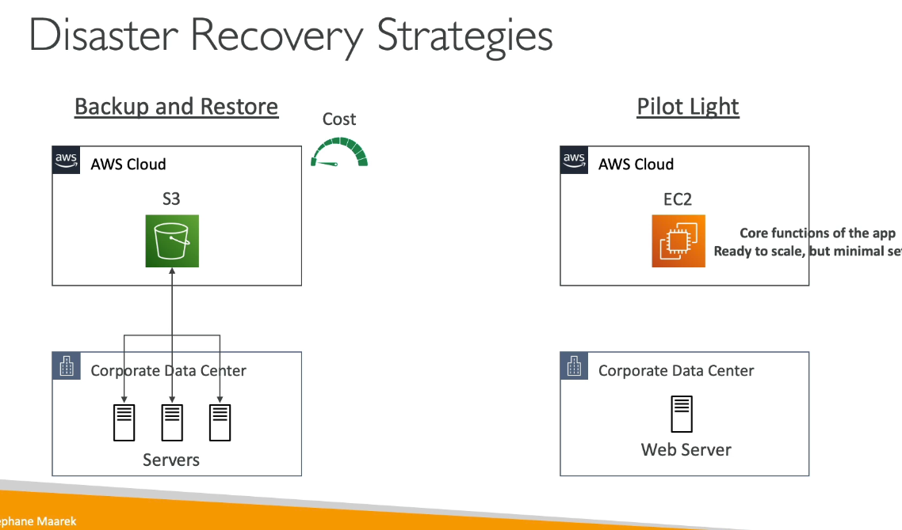
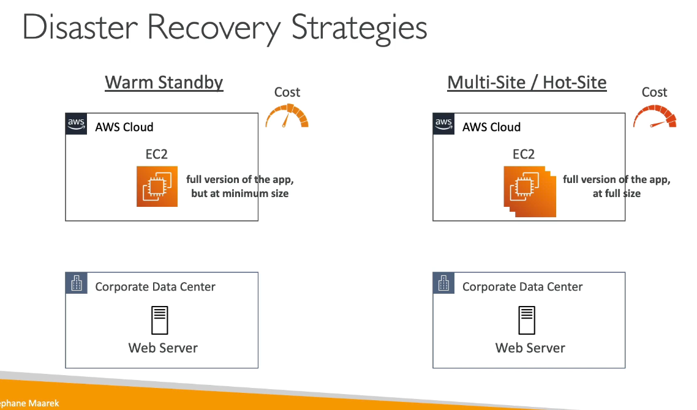
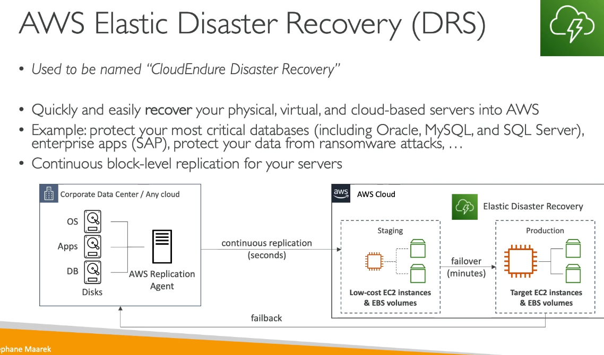

# AWS Other Services
## Amazon Workspaces
- Amazon Workspaces is a managed Desktop as a Service (DaaS) solution to easily provision Windows or Linux desktops.
- Great to eliminate management of on-premise VDI (virtual desktop infrastructure)
- Fast and scalable
- Secured data - integrates with KMS
- Pay as you go 
- Best practice is to deploy workspace as close to user as possible
## Amazon AppStream 2.0 
- Desktop Application Streaming Service
- Stream specific Desktop Application into your web browser
- works with any device that has a web browser
- allowed to configure an instance type per application (CPU, GPU, RAM)
## AWS IoT Core
- Allows you to easily connect IoT devices into the cloud
- Allows devices to communicate even when they are not connected
- Integrates with a lot of AWS services
- gather, process and analyze and act on data
## AWS elastic transcoder
- coverts media files stored in S3 into media files in the formats required by consumer playback devices (phones etc...)
- Input S3 bucket -> run through transcoding pipeline -> Output to S3 bucket -> Consumable by Smartphones, Tablets, PCs and etc.

Pros:
- Easy to use
- Highly Scalable - can handle large volumes of media files and large file sizes
- Cost effective, aws fully managed and secure

## AWS AppSync
- Store and sync data across mobile and web apps in real-time using GraphQL
- In the test if you see GraphQL it will hint heavily for you to use AppSync
- Integrations with DynamoDB / Lambda
- Real-time subscriptions
- Offline data synchronizations (replaces cognito sync)
- Fine Grained Security
- AWS amplify can leverage AWS  AppSync in the background
## AWS Amplify
- Is a set of tools and services that helps you develop and deploy scalable full stack web and movie applications
## AWS Device Farm 
- Fully managed service that tests your web and mobile apps against desktop browsers, real mobile devices and tablets
- Run tests concurrently on multiple devices (speed up execution)
- Ability to configure device settings (GPS, language, Wi-Fi, Bluetooth)
- Device Farm will send logs back to user
## AWS backup
- Fully managed service to automate and manage back ups across AWS services
- Create back up plan and then assign resources to the back up plan and will be stored in AWS S3
## Disaster Recovery Strategies

- Multi-Region setup can failover from us-east-1 to eu-west-2 in the instance of a regional failure
## AWS Elastic Disaster Recovery
- Allows you to quickly and easily recover your physical, virtual, and cloud-based servers into AWS
- Performs Continuous block-level replication for your servers

## AWS DataSync
- Move large amount of data from on-premises to AWS
- Can synchronize to: Amazon S3 (any storage class), Amazon EFS, Amazon FSx for Windows
- Replications tasks can be scheduled hourly, daily and weekly
- replication tasks are incremental after the first full load 