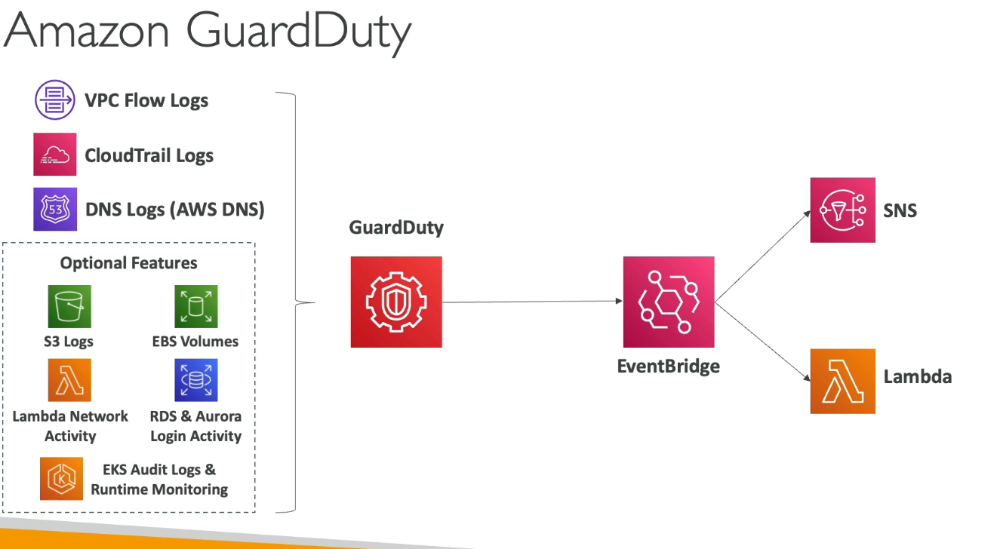

# Security & Compliance

## AWS Shared Responsibility Model (security in the cloud)
- AWS responsibility - Security of the Cloud
- AWS responsibility - Protecting infrastructure (hardware, software, facilities, and networking) that runs all the AWS services
- AWS responsibility - Managed Services
- Customer responsibility - For EC2 instance, customer is responsible for management of the guest OS, firewall, network configuration & IAM.
- Shared Controls - Awareness & training, patch management

## RDS example
AWS responsibility: 
- OS, DB, underlying EC2 instance and underlying disks & guarantee it functions
Your responsibility:
- Check the ports / IP / security group inbound rules in DB's SG
- In-database user creation and permissions
- Creating database with or with publich access
- Database encryption
## S3 Example
AWS Responsibility:
- Guarantee you get unlimited storage, encryption and separation of the data between different customers
Your responsibility:
- Bucket configuration, policy/public setting, IAM user and roles, enabling encryption

## AWS DDOS Protection on AWS
AWS Shield Standard:
- protects against DDOS attack for your website and applications, for all customers at no additional costs
- Free Service, provides protection from attacks such as SYN/UDP Floods, Reflection attacks and other layer 3 and 4 attacks.

AWS Shield Advanced:
- Optional DDoS mitigation service($3,000 per month per organization)
- Protects against more sophisticated attacks on EC2, ELB. CloudFront, Global Accelerator and Route53
- 24/7 access to AWS DDoS response team (DRP)
- 24/7 premium DDoS protection
- Protect against higher fees during usage spikes due to DDoS

AWS WAF: 
- Filter Specific requests based on rules
- Protects Web App from common Layer 7 attacks (SQL injection, XXS)
- Deploy on ALB, API Gateway, CloudFront

CloudFront and Route53:
- Availability protection using global edge network
- Combined with AWS Shield, provides attack mitigation at the edge.
## AWS Network Firewall
- AWS network firewall service will protect your entire Amazon VPC
- From Layer 3 to Layer 7
- Can inspect VPC to VPC traffic, Outbound to internet, inbound from internet and DirectConnect/Site-to-Site VPN
## Pen-testing on the cloud
You can Pen-test only 8 AWS Services:
What is prohibited on AWS?
- DNS zone walking via Amazon Route 53 Hosted Zones
- Denial of Service (DoS), Distributed Denial of Service (DDoS), Simulated DoS, Simulated DDoS
- Port flooding, protocol flooding, request flooding
## Encryption
AWS KMS:
- AWS manages the encryption keys for us
- Encryption for EBS volumes, S3 buckets, Redshift database, EFS drives
- Encryption automatically enabled on CloudTrail logs, S3 Glacier, Storage Gateway

CloudHSM:
- AWS provisions encryption hardware
- You manage your own encryption keys

Types of Customer Master Keys (CMK):
- Customer Managed Keys
    - Create, manage and used by the customer, can enable or disable
    - Possibility of rotation policy (new key generated every year, old key preserved)
- AWS managed CMK
    - Created, managed and used on customer's behalf on AWS
    - USed by AWS services
- AWS owned CMK:
    - Collection of CMKs that an AWS service owns and manages to use in multiple accounts
    - AWS can use those to protect resources in your account (but you can't view the keys)
- Cloud HSM Keys
    - Keys are generated from your own HSM hardware device.

## AWS KMS hands ON
- AWS managed keys, customer managed keys and custom key stores are your options
- AWS managed keys can be used to encrypt things like and EBS volume and not worry about managing the key.
-  Can create customer managed keys using KMS, you would then define key admins and users.  There will be policies attached to the key.  This key can be rotated and applied to things like an EBS volume.
## AWS Certificate Manager (ACM)
- Allows you to easily provision, manage and deploy SSL/TLS Certificates
- Used to provide in-flight encryption for websites (HTTPs)
- ACM would be loaded to the Application Load Balancer so that it can offer HTTPS.
- Supports both public and private TLS
- Automatic TLS certificate renewal
- integrates east with Load balancers , Cloudfront Distributions, API gateway.
## AWS Secrets Manager
- Easily rotate credentials, secrets are encrypted using KMS
- Mostly meant for RDS Integration?? We use this for storing secrets we want to call programmatically.

## AWS Artifact
- Is a portal where customers can access AWS compliance documentation and AWS agreements (PCI,  SOC).
- Artifact Agreements review and track the status of AWS agreements such as HIPAA, BAA for an individual account in org.

## AWS GuardDuty
- Intelligent Threat discovery to protect your AWS account
- Use Machine Learning algorithms, anomaly detections, 3rd party data
- input data includes: Cloud trail event logs, VPC Flow Logs, DNS logs, Optional Features like EKS audit logs, RDS & Aurora, EBS, Lambda, S3 Data Events
- Can set up event bride rules to be notified in case of findings.  EventBridge rules can target AWS Lambda or SNS.
- Can protect against CryptoCurrency attacks (has a dedicated "finding" on it)
## Example Workflow
Guard Duty can recognize findings from the event data, create an event bridge and direct that to an SNS topic or to a lambda function

## Amazon Inspector
- Automated Security Assessments 
- Can be used on EC2 instances and Container Images
Lambda Functions:
- Identifies software vulnerabilities in function code and package dependencies
- Assessment of functions as they are deployed
- Inspector has reporting and integration with AWS Security Hub
- Send findings to Amazon Event Bridge
- Inspector is only for running EC2 instances, Container Images and Lambda Functions.
- Looks for Network Reachability, Package vulnerabilities, will attach risk score to vulnerabilities.
## AWS Config
- Records configuration and changes over time
- Helps audit and record compliance of your AWS resources
- Solves the questions of:
    - Is there unrestricted SSH access to my security groups(EC2 instances)
    - Do my buckets have an public access?
    - How has my ALB configuration changed over time?
- You can receive alerts (SNS notifications) for any changes?
- AWS Config is a per-region service
- Can be aggregated across regions and accounts
- Can view compliance of a resource over time
- Can view configuration of a resource over time
## AWS Macie
- Fully managed data security and data privacy service that uses machine learning and pattern matching to discover and protect your sensitive data in AWS.
- Macie helps identify and alert you to sensitive data, such as personally identifiable information (PII) in an S3 bucket. Macie will notify EventBridge and you can integrate it how you desire.
## AWS Security Hub
- Central Security tool to manage security across several AWS accounts and automate security checks
- Integrated dashboards showing current security and compliance status
- Automatically aggregates alerts in predefined or personal findings formats from various AWS services & partner tools
- aggregates data from Config, Guard Duty, Inspector, Macie, AWS SSM, AWS Firewall manager, AWS Health, IAM Access Analyzer
- When there is a security issue it will generate an EventBridge
- Requires AWS config to be enabled, you can also set security standards
## Amazon Detective
- This will help you determine the root cause for security findings.  It will analyze, investigate and quickly identify the root cause
- Automatically collect events from VPC flows logs, Cloudtrail and GuardDuty
## AWS Abuse
- Report suspected AWS resource abuse
- Port scanning your resources
- DoS or DDoS attacks
- intrusion attempts
- hosting objectionable or copyrighted consent
- distributing malware
## Root User Priviliges
- Root user is the account owner and has complete access
- Do not use Root user access keys or everyday tasks.
- Only the root user can change the account settings, view tax invoices, close AWS account, restore IAM user permissions, change or cancel AWS support plan
- Configure S3 bucket to enable MFA
- Sign up for GovCloud
## IAM Access Analyzer
- Used to find out which resources are shared externally
- Defines Zone of Trust = AWS account or AWS Org
- Access outside zone of trusts => findings
- 

