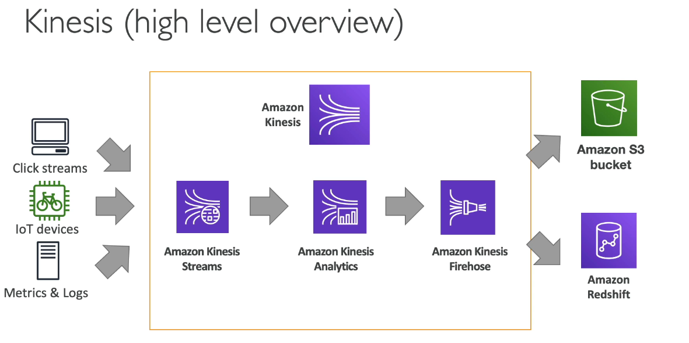

# Cloud Integration
- Synchronous Communications (Application to Application)
- Asynchronous/Event Based (application to queue to application)

It is best practice to decouple the applications and use something like 
- SQS: Queue Model
- SNS: Pub/Sub Model
## Simple Queue Service (SQS)

SQS allows you to decouple your applications!

Producer will send messages to a queue, there will a consumer on the other side of the queue that will be polling the queue, process the message and then delete the message from the queue.

Fully Managed Service, Scales Seamlessly and is also AWS's oldest AWS offering!

FIFO Queue = First in First out (ordering of messages in the queue)
## AWS Kinesis
- Real time big data streaming
- Managed service to collect, process and analyze real time streaming data at any scale
- Kinesis Data Streams: low latency streaming to ingest data at scale from hundreds of thousands of sources
- Kinesis Data Firehose: load streams into S3, Redshift, ElasticSearch and etc.
- Kinesis Data Analytics: Performs realtime analytics on stream using SQL
- Kinesis Data Streams: Monitor real-time video stream for analytics or ML

## Amazon SNS
Pub/Sub

Service send message to SNS topic which can then disperse the messages to the appropriate people.  SNS topics will have subscribers that will receive all the messages.
- up to 12,500,000 subscriptions per topic, 100,000 topics limit
Can target SQS, Lambda, Kinesis, SMS, Emails, HTTP endpoints.

## Amazon MQ
Is a managed message broker service for RabbitMQ and ActiveMQ that utilize the older MQTT, AMQP, STOMP, Openwire, WWS protocols. 