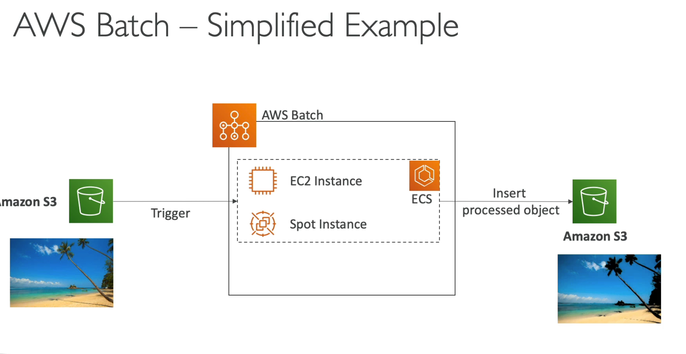

# Other Compute Services: ECS, Lambda, Batch, Lightsail

## ECS
You must provision and maintain the infrastructure (EC2 instances).
ECS allows you to launch docker containers on AWS.  Has integrations with the Application Load Balancer.
## Fargate
We don't need to create any infrastructure (EC2).  Fargate is a Serverless offering. AWS just runs containers for you based on the CPU/RAM you need.  Fargate will run containers/tasks.
## ECR 
Elastic Container Registry, this is private registry on AWS where you can store docker images that can be run by ECS or Fargate.

## Serverless
What does serverless mean? it is a way of developers deploying code in something like a function and prevents engineers from managing or provisioning the servers.
ex: DynamoDB, S3, Fargate, Lambda
## Lambda
This is a virtual function that will run by demand, it has short execution time periods and will scale as needed.
- Lambda is event driven and will get invoked when needed or an event happens.
- Easy monitoring through cloudwatch
- Integrated with the whole AWS suite of services

- Lambda Container Image allows you to run docker containers on top of lambda.  The container must utilize lambda runtime API.
- Cron jobs are easy on Lambda, we can use Cloudwatch events to trigger an invocation.

### Lambda Cost
- Pay Per Calls: 
First 1,000,000 requests are free. $0.20 per 1 million requests thereafter.  
- Pay per duration 
## API Gateway
Building a serverless API,
EX: API Gateway in front of Lambda Function, Gateway will proxy requests to the function and then the function will do it's job. 
API Gateway is Serverless, API throttling, API Keys and monitoring.
## AWS Batch
Fully managed Batch processing service.  Batch job is a job that has a start and an end.  The Batch services will dynamically launch EC2 instances or spot instances to complete the batch job.  
- Batch jobs are defined as Docker images and run on ECS.

Batch has no time limit, any runtime as long as it can be packaged as a docker image. Batch relies on EC2.
## AWS Lightsail
You can get virtual servers, storage, databases and networking.
Use Case: Much simpler alternative to use EC2, RDS, ELB, EBS, Route 53 and etc. 
- Great for people with little cloud experience
- Limited AWS integrations but no auto-scaling
