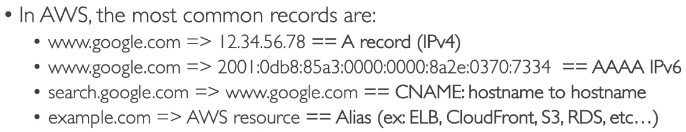

# Leveraging AWS Global Infrastructure
## Why Deploy Globally
A global application is an application deployed in multiple geographies.  On AWS this would be Regions, deploying to multiple geographies will decrease latency for users across the world.  Having apps in different region helps when it comes to Disaster Recovery and could help in the case of a Cyber Attack. 
- [AWS INFRASTRUCTURE](https://aws.amazon.com/about-aws/global-infrastructure/regions_az/)
## AWS Route 53
- Managed DNS
- DNS is a collection of rules and records which helps clients understand how to reach a server through URLs.

## Routing Polcies
- Simple Routing policy (no health checks)
- Weighted Routing Policy (distribute traffic across routes, will use health checks)
- Latency Routing Policy, will look at where the user is located and utilize the server that is nearest to them.  This minimizes latency
- Failover Routing Policy, Primary instance and Failover. Route53 will determine where to route traffic to based on the health check of the instances.  This is good for disaster recovery.
