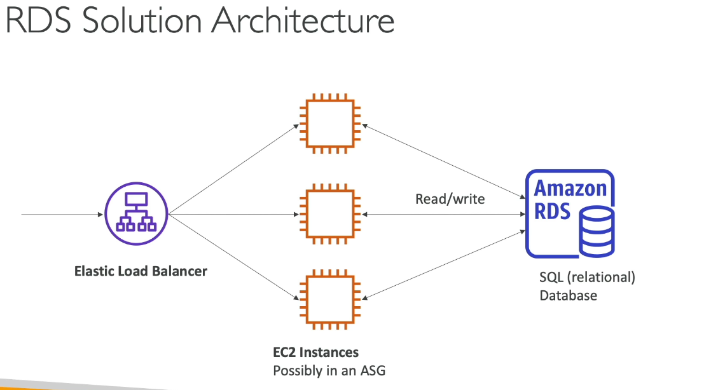
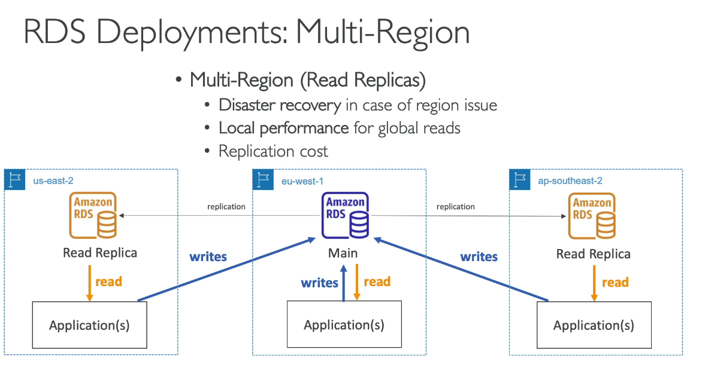
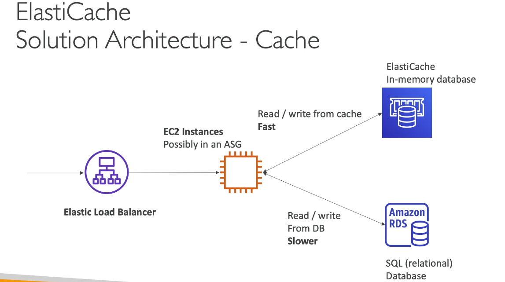

# Databases and Analytics
Databases allow us to structure the data and efficiently query and search the data.

## Relational Databases
- Similar to excel spreadsheets, these databases have similarities to each other that can be used as links.  Columns can have relationships to other columns in a different table
## NoSQL Databases
These are non relation databases, they have flexible schemas that are good for building modern applications.  In a NoSQL Database you can have data in JSON format. 
Benefits: 
- Flexibility
- Scalability
- High Performance

## Databases & Shared Responsibility Model on AWS
- AWS offers use to manage different databases
- managed databases are easily provisioned, highly available, vertical and horizontally scaling, automated back ups, restoration, operations and upgrades.
- OS patching is handled by AWS
# AWS RDS
Amazon Relation Database Services is a Managed Database Service that uses the SQL query language.  AWS will provide all the features it provides for it's managed Databases.  RDS has storage backed by EBS, you cannot SSH into these databases.
## Hands-On 
In the console you can go to Amazon RDS -> Databases and create a database.  Here is where you will specify whether it should be a production ready DB, dev or free tier.  You can then customize the EBS type/size, the compute type and networking of the Database when creating it as well.

## 
## RDS Deployment Options
Read Replicas:
- Read Replicas allow you to create copies of your RDS Database and will allow you application to read from the replicas.  You can create up to 15 Read Replicas.

- Data is only WRITTEN to the main Database not the read replicas

Multi-AZ:
- Failover in case of AZ outage (High-Availability)
- Application will still read from main RDS database, but we will have replication across AZ (Failover DB).  The Failover DB is passive and not available until there is a failure.

Multi-Region:

- Read Replicas will be across different regions, read replica will be in us-east-1, the main DB would be in eu-west-1.  Reads can happen to the application in the same region but write would be sent to the main DB (eu-west-1).

## AWS Aurora
### Aurora is a relational database

Aurora is a proprietary technology from AWS.  Supports both PostgresSQL and MySQL, Aurora is AWS cloud optimized and claims better performance than RDS.  Aurora storage will grow automatically in increments of 10GB.  Not in Free Tier
## Amazon ElastiCache
ElastiCache to get managed Redis or Memcached Database.  Caches are in-memory databases with high performance, low latency.  The idea is to make load less intensive for common reads from the database.  Cache will have it in memory and will be less load intensive to retrieve and provide the data.

### AWS takes care of OS maintenance, monitoring, failure and backups.
## ElastiCache Solution Architecture
Will read and write data from RDB and will cache data in ElastiCache DB when possible so that there can be pressure taken off the RDB and data will be more accessible from ElastiCache

## DynamoDB
Fully Managed Highly Available Database with replication across 3 AZ.  DynamoDB is part of the NoSQL database and is SERVERLESS.  DynamoDB scales and has great low latency.  Key/Value Database
- Primary Key: Made of 1-2 columns that will have a Partition Key and Sort Key.
- Attributes:  Schema is defined per item.  Data will be entered row by row

### DynamoDB Accelerator (DAX)
Fully Managed in-memory cache for DynamoDB, You can take the most frequently read data and cache it in-between the app and DynamoDB.  DAX is only used with DynamoDB.  ElastiCache can be used for other Databases.

### Hands-On
Create a table, define partition key, choose default settings and then create table.  Attribute are defined by the user, they will be key value pairs.  The partition key will be the main thing we want to track (USER_ID), the attributes will contain information for that specific USER_ID and populate that data in the same row.

### Global Tables: 
Low Latency in multiple regions. Active-Active Replication (read/write to any AWS region)

## Redshift
Best for cases where you will be doing computations on the data
- Based on PostgreSQL, but it's not used for Online Transaction Processing.  Redshift is good for OLAP (Online Analytical Processing, Analytical and Data Warehousing)
- Scales to PBs of data
- 10x better performance than other data warehouses
- Columnar storage of data (instead of row based)
- Massively Parallel Query Execution
- Has a SQL interface for performing quick queries
- BI tools such as AWS Quicksight or Tableau integrate with it
## Amazon EMR
EMR "Elastic MapReduce"
- EMR helps creating Hadoop clusters (Big Data) to analyze and process data
- Clusters can be made of 100s of EC2 instances that will be used to process data.  EMR takes care of provisioning and configuration of the instances that will be doing the data processing, machine learning and big data tasks
## Amazon Athena
Athena is a serverless query service to perform analytics against S3 objects.  It uses SQL to query the data, supports CSV, JSON, ORC, Avro and Parquet.  Athena is built on Presto Engine
- Process: Load Data to S3, Query - Analyze S3 Data from Athena, Use Quicksight to visualize data. 
Pricing: $5.00 per TB of data scanned
Exam Tip: analyze data in s3 using serverless SQL, use Athena
## Amazon Quicksight
Serverless machine learning powered business intelligence service to create interactive dashboards. (Visually Represent Data) 
- Get business insights using data
## DocumentDB
AWS version of MongoDB (NoSQL Database)
- Mongo DB is used to store, query and index JSON data
- Fully Managed DB, HA, replicated across 3 AZ
- Storage grows in increments of 10GB, up to 64 TB
- Automatically for high workloads
## Amazon Neptune
Fully managed Graph Database
- HA across 3 AZ, with up to 15 read replicas.
- Can store up to billions of relations
- Build and run applications working with highly connected datasets
- Great for knowledge graphs (Wikipedia)
## Amazon QLDB
- QLDB is Quantum Ledger Database
- Ledger is a book recording financial transactions
- Fully Managed, Serverless, HA, Replication across 3 AZ
- Used to review history of all changes to your application data over time
- Immutable System: No entry can be removed or modified, utilized hashes to maintain integrity
- can manipulate data using SQL
- No decentralization component, in accordance with financial regulation rules
- QLDB is central, Blockchain is not centralized
## Amazon Managed Blockchain 
- Blockchain makes it possible to build apps here multiple parties can execute transactions without the need for a trusted, central authority.
- Is a service to join a public blockchain network or create your own scalable private network.
- Compatible with HyperLedger and Ethereum
## Amazon Glue
- Managed ETL service (extract, transform, load)
- Glue will prepare and transform data
- Fully Serverless
- Glue can extract data from S3, the data will then be transformed by a script and then will load the data to something like Athena.

## Amazon DMS
Database Migration Service
- EC2 instance running DMS will extract data from source database and then insert the data back to target database that will be somewhere else.  Source DB will remain available during migration.
- Support Homogenous migrations: Oracle to Oracle 
- Supports Heterogeneous migrations: Microsoft SQL server to Aurora   
Anytime Migration of Database is mentioned in exam this of DMS (Database Migration Service)